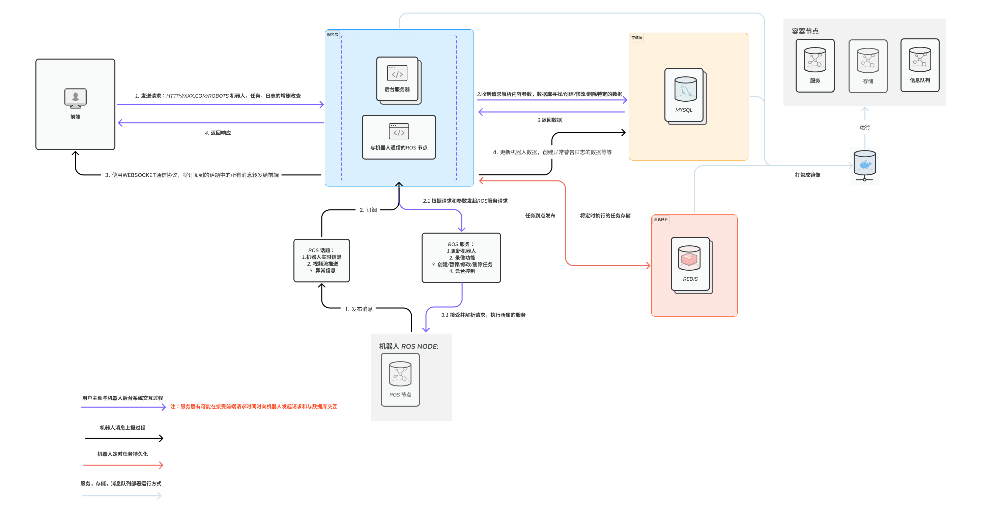

<!-- Improved compatibility of back to top link: See: https://github.com/othneildrew/Best-README-Template/pull/73 -->
<a name="readme-top"></a>
<!--
*** Thanks for checking out the Best-README-Template. If you have a suggestion
*** that would make this better, please fork the repo and create a pull request
*** or simply open an issue with the tag "enhancement".
*** Don't forget to give the project a star!
*** Thanks again! Now go create something AMAZING! :D
-->


<!-- PROJECT SHIELDS -->
<!--
*** I'm using markdown "reference style" links for readability.
*** Reference links are enclosed in brackets [ ] instead of parentheses ( ).
*** See the bottom of this document for the declaration of the reference variables
*** for contributors-url, forks-url, etc. This is an optional, concise syntax you may use.
*** https://www.markdownguide.org/basic-syntax/#reference-style-links
-->


<!-- PROJECT LOGO -->
<br />
<div align="center">
  <a href="https://gitee.com/ZJCXJSLtd/patrol-robot-monitoring-system-cpy">
    
  </a>

  <h3 align="center">巡检机器人后台系统</h3>
  <a href="./README.md">English</a> | <strong>简体中文</strong>
  <p align="center">
    <br />
    <a href="https://gitee.com/ZJCXJSLtd/patrol-robot-monitoring-system-cpy"><strong>探索项目 »</strong></a>
    <br />
    <br />
    <a href="https://gitee.com/ZJCXJSLtd/patrol-robot-monitoring-system-cpy">快速开始</a>
    ·
    <a href="https://gitee.com/ZJCXJSLtd/patrol-robot-monitoring-system-cpy/issues">报告错误</a>
    ·
    <a href="https://gitee.com/ZJCXJSLtd/patrol-robot-monitoring-system-cpy/issues">请求功能</a>
  </p>
</div>


<!-- TABLE OF CONTENTS -->
<details>
  <summary>内容目录</summary>
  <ol>
    <li>
      <a href="#about-the-project">关于项目</a>
      <ul>
        <li><a href="#design">架构设计</a></li>
        <li><a href="#built-with">构建所需</a></li>
      </ul>
    </li>
    <li>
      <a href="#getting-started">开始使用</a>
      <ul>
        <li><a href="#prerequisites">先决条件</a></li>
        <li><a href="#installation">安装步骤</a></li>
      </ul>
    </li>
    <li><a href="#usage">使用示例</a></li>
    <li><a href="#contributing">贡献</a></li>
    <li><a href="#license">许可证</a></li>
    <li><a href="#acknowledgments">致谢</a></li>
  </ol>
</details>


<!-- ABOUT THE PROJECT -->
<a id="about-the-project"></a>
## 关于项目

巡逻机器人系统是一个专为各种环境的远程监控和监视设计的高级系统。该系统旨在提供巡逻机器人系统的状态、位置和活动的实时信息。

该系统还配备了一系列先进的功能，包括报警管理、数据收集、数据存储和数据分析。这些功能使得系统能够基于预定义的规则生成警报，并分析收集的数据以识别趋势、异常和潜在的问题。

<p align="right">(<a href="#readme-top">back to top</a>)</p>

<a id="design"></a>
### 架构设计



<a id="built-with"></a>
### 构建所需

本项目使用了几种技术构建，包括：

1. **ROS** (机器人操作系统)：编写机器人软件的灵活框架。它是一套工具、库和约定的集合，简化了创建复杂且健壮的机器人行为的任务。

2. **FastAPI**：一个现代的、快速（高性能）的，用于构建API的Python 3.6+网络框架，基于标准的Python类型提示。

3. **Celery**：基于分布式消息传递的异步任务队列/作业队列。它专注于实时操作，但也支持调度。

4. **Redis**：一个开源（BSD许可的）内存数据结构存储，用作数据库、缓存和消息代理。

5. **MySQL**：一个开源的关系数据库管理系统。

这些工具和技术共同构成了我们项目的骨干，为我们的需求提供了强大、可扩展和高效的平台。

<p align="right">(<a href="#readme-top">back to top</a>)</p>


<!-- GETTING STARTED -->
<a id="getting-started"></a>
## 开始使用

这是一个如何在本地设置您的项目的指南示例。
要获取并在本地运行这个项目，请遵循以下简单的步骤。

<a id="prerequisites"></a>
### 先决条件

要运行此项目，您需要：
- 安装 [Docker](https://docs.docker.com/get-docker/)

<a id="installation"></a>
### 安装步骤

_以下是一个如何指导您安装和设置您的应用程序的例子。_

1. 克隆仓库
   ```sh
   git clone https://gitee.com/ZJCXJSLtd/patrol-robot-monitoring-system-cpy.git
   ```
2. 导航到项目目录
   ```sh
   cd patrol-robot-monitoring-system-cpy
   ```
3. 构建镜像
   ```sh
   docker compose build 
   ```


<p align="right">(<a href="#readme-top">back to top</a>)</p>


<!-- USAGE EXAMPLES -->
<a id="usage"></a>
## 使用示例

展示一个项目如何使用例子。

_这个项目是基于ROS（机器人操作系统）开发的。由于ROS官方网站不提供MacOS操作系统的安装，所以这个镜像不能在MacOS操作系统上运行。_

1. 启动服务
   ```sh
   docker compose up -d
   ```
2. 检查服务
   ```sh
   docker ps
   
   CONTAINER ID   IMAGE          COMMAND                  CREATED       STATUS       PORTS                               NAMES
   c0ea67aa47a6   417106dd6a74   "/ros_entrypoint.sh …"   6 hours ago   Up 6 hours   0.0.0.0:8000->8000/tcp              app
   b048af054ece   53211154db2f   "/ros_entrypoint.sh …"   6 hours ago   Up 6 hours                                       ros_core
   2ba53f0125c7   417106dd6a74   "/ros_entrypoint.sh …"   6 hours ago   Up 6 hours   8000/tcp                            patrol-robot-monitoring-system-celery-worker-1
   a249f6aa1715   mysql:8.0      "docker-entrypoint.s…"   6 hours ago   Up 6 hours   0.0.0.0:3306->3306/tcp, 33060/tcp   patrol-robot-monitoring-system-db-1
   c1532e06141d   redis:latest   "docker-entrypoint.s…"   6 hours ago   Up 6 hours   0.0.0.0:6379->6379/tcp              redis
   ```
 3. 访问 http://localhost:8000/docs 来浏览APIs。


   
<p align="right">(<a href="#readme-top">back to top</a>)</p>


<!-- CONTRIBUTING -->
<a id="contributing"></a>
## 贡献

贡献是成为学习、启发和创造的惊人之地的因素。您所做的任何贡献都非常感谢。

如果您有让这个更好的建议，请fork仓库并创建一个拉取请求。您也可以只是简单地打开一个带有“增强”标签的问题。

Fork该项目
创建您的特性分支 (git checkout -b feature/AmazingFeature)
提交您的更改 (git commit -m 'Add some AmazingFeature')
推送到分支 (git push origin feature/AmazingFeature)
打开一个Pull Request

<p align="right">(<a href="#readme-top">back to top</a>)</p>


<!-- LICENSE -->
<a id="license"></a>
## License
在GNU General Public License v3.0下分发. 更多信息请查看 LICENSE 文件。

<p align="right">(<a href="#readme-top">back to top</a>)</p>


<!-- ACKNOWLEDGMENTS -->
<a id="acknowledgments"></a>
## 致谢

* [FastAPI](https://fastapi.tiangolo.com/)
* [ROS](http://wiki.ros.org/)
* [Docker](https://docs.docker.com/)
* [Celery](https://github.com/celery/celery)
* [Redis](https://redis.io/)
* [MySQL](https://www.mysql.com/)

<p align="right">(<a href="#readme-top">back to top</a>)</p>
